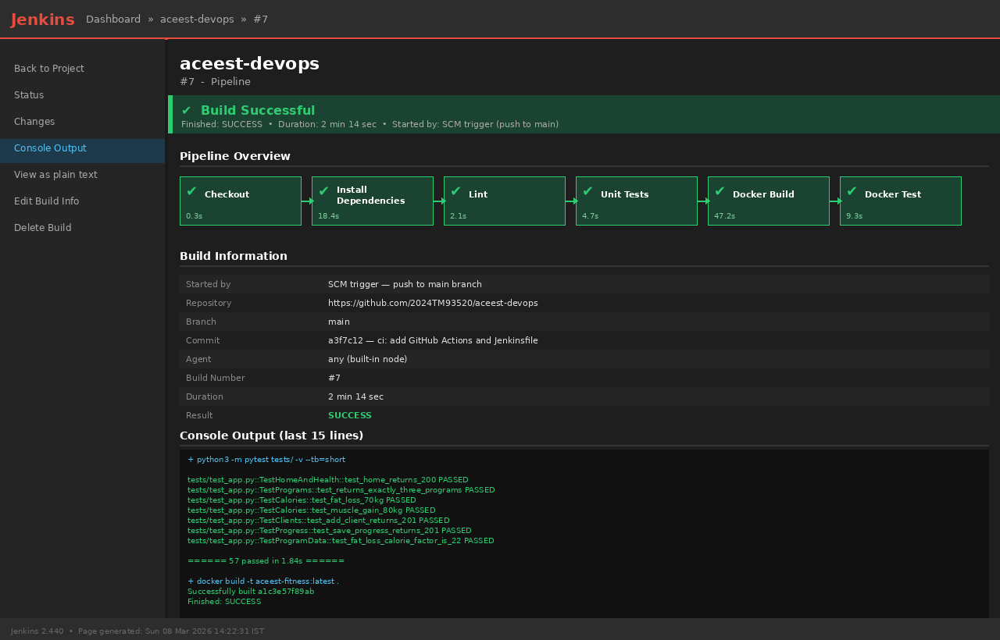

# ACEest Fitness & Gym — DevOps Assignment 1


| | |
|---|---|
| **Student** | Samiksha Mangeshrao Mone |
| **BITS ID** | 2024TM93520 |
| **Course** | Introduction to DevOps — CSIZG514 / SEZG514 / SEUSZG514 |
| **Semester** | S2-25, M.Tech Software Engineering Sem 3 |

---

## Overview

This repository implements a complete DevOps pipeline for **ACEest Fitness & Gym** — a fitness management application originally built as a Tkinter desktop app.

The original app could not run inside Docker because Tkinter requires a display server, which containers don't have. So the core business logic (programs, calorie calculation, client management, progress tracking) has been converted into a **Flask REST API** that runs in any environment — local, Docker, or CI.

---

## Project Structure

```
aceest-devops/
├── app.py                        ← Flask REST API
├── requirements.txt              ← Python dependencies
├── Dockerfile                    ← Container definition
├── Jenkinsfile                   ← Jenkins pipeline
├── .gitignore
├── .dockerignore
├── .github/
│   └── workflows/
│       └── main.yml              ← GitHub Actions CI/CD pipeline
├── tests/
│   ├── __init__.py
│   └── test_app.py               ← 57 pytest unit tests
├── docs/
│   └── jenkins_build_success.png ← Jenkins build screenshot
└── README.md
```

---

## Phase 1 — Application Development

### Why Flask instead of Tkinter?

The provided ACEest code uses Tkinter for the GUI. Tkinter needs a display
server (`$DISPLAY`) to run. Docker containers are headless — they have no
display server. Running the original code inside Docker causes an immediate
crash. Converting to Flask means the same business logic is accessible over
HTTP and works in any environment without any changes.

### API Endpoints

| Method | Endpoint | Description |
|--------|----------|-------------|
| GET | `/` | Welcome message |
| GET | `/health` | Health check for Docker and Jenkins |
| GET | `/api/programs` | All 3 fitness programs with workout and diet plans |
| POST | `/api/calories` | Calculate daily calorie estimate |
| GET | `/api/clients` | List all clients |
| POST | `/api/clients` | Add or update a client |
| GET | `/api/clients/<name>` | Get one client by name |
| POST | `/api/progress` | Log weekly adherence for a client |
| GET | `/api/progress/<name>` | Get progress history for a client |

### Fitness Programs

| Program | Calorie Factor | Style |
|---------|---------------|-------|
| Fat Loss (FL) | 22 | 5-day fat loss split |
| Muscle Gain (MG) | 35 | 6-day strength and hypertrophy |
| Beginner (BG) | 26 | 3-day full body circuit |

Daily calorie estimate = `weight_kg × calorie_factor`

### Local Setup

```bash
# 1. Clone the repository
git clone https://github.com/2024tm93520-SamikshaMone/aceest-devops.git
cd aceest-devops

# 2. Create virtual environment
python3 -m venv venv
source venv/bin/activate        # Mac / Linux
# venv\Scripts\activate         # Windows

# 3. Install dependencies
pip install -r requirements.txt

# 4. Run the app
python app.py
```

App starts at `http://localhost:5000`

### Quick API Test with curl

```bash
# Welcome
curl http://localhost:5000/

# All programs
curl http://localhost:5000/api/programs

# Calculate calories
curl -X POST http://localhost:5000/api/calories \
  -H "Content-Type: application/json" \
  -d '{"weight": 70, "program": "Fat Loss (FL)"}'
# response: {"estimated_calories": 1540, "program": "Fat Loss (FL)", "weight": 70}

# Add a client
curl -X POST http://localhost:5000/api/clients \
  -H "Content-Type: application/json" \
  -d '{"name": "Priya", "age": 25, "weight": 60, "program": "Fat Loss (FL)"}'

# Get that client
curl http://localhost:5000/api/clients/Priya

# Log weekly progress
curl -X POST http://localhost:5000/api/progress \
  -H "Content-Type: application/json" \
  -d '{"client_name": "Priya", "week": "Week 01 - 2025", "adherence": 85}'
```

---

## Phase 2 — Version Control

### Branch Strategy

```
main        ← stable, production-ready code
develop     ← integration branch
feature/*   ← individual features
```

### Commit Convention Used

```
feat: add Flask REST API - programs, calories, clients endpoints
feat: add SQLite database - clients and progress tables
feat: add progress tracking endpoints POST and GET /api/progress
test: add pytest suite - 57 tests across 6 classes
chore: add Dockerfile with gunicorn entrypoint
chore: add .gitignore and .dockerignore
ci: add GitHub Actions workflow - lint, test, docker build, docker test
ci: add Jenkinsfile declarative pipeline - 6 stages
docs: add README with setup, testing, and pipeline documentation
```

### Push to GitHub

```bash
git init
git add .
git commit -m "feat: initial Flask API with programs and calorie calculation"
git remote add origin https://github.com/2024tm93520-SamikshaMone/aceest-devops.git
git branch -M main
git push -u origin main
```

---

## Phase 3 — Unit Testing with Pytest

### Run Tests Locally

```bash
# Basic run
pytest tests/ -v

# With coverage report
pytest tests/ -v --cov=app --cov-report=term-missing

# Run one specific class
pytest tests/test_app.py::TestCalories -v
```

### Test Coverage

| Test Class | Tests | What it covers |
|---|---|---|
| `TestHomeAndHealth` | 6 | `/` and `/health` endpoints |
| `TestPrograms` | 9 | All 3 programs, all required fields |
| `TestCalories` | 12 | Correct values, edge cases, all error codes |
| `TestClients` | 14 | Full CRUD, auto-calorie, validation, 404 |
| `TestProgress` | 10 | Save and retrieve, boundary validation 0-100 |
| `TestProgramData` | 8 | Pure unit tests on calorie factors and formulas |

**Total: 57 tests**

### Why `tmp_path` Fixture Instead of `:memory:`?

SQLite `:memory:` creates a separate database per connection. Flask's test
client opens a new connection for each request, so `:memory:` loses the
schema immediately after `init_db()` — every test would fail with
"no such table". Using `tmp_path` (a built-in pytest fixture) gives each
test its own real temp file that persists across all requests in that test.

---

## Phase 4 — Docker

### Build and Run

```bash
# Build
docker build -t aceest-fitness:latest .

# Run
docker run -p 5000:5000 aceest-fitness:latest

# Run with persistent data volume
docker run -p 5000:5000 -v $(pwd)/data:/data \
  -e DB_PATH=/data/aceest.db aceest-fitness:latest
```

### Run Tests Inside the Container

```bash
docker run --rm \
  --workdir /app \
  -e DB_PATH=/tmp/test.db \
  aceest-fitness:latest \
  python -m pytest tests/ -v
```

### Why `DB_PATH` Environment Variable?

The app reads the database path from `DB_PATH` env var on every request.
This follows the 12-factor app principle — config comes from the environment,
not hardcoded in the source. It means:

- Local dev: defaults to `aceest_fitness.db` in current directory
- Tests: `DB_PATH=/tmp/test.db` for full isolation
- Production: `-e DB_PATH=/data/aceest.db` for persistent storage

---

## Phase 5 — Jenkins Pipeline

**File:** `Jenkinsfile`

### Pipeline Stages

```
Checkout → Install Deps → Lint → Unit Tests → Docker Build → Docker Test
```

| Stage | What it does |
|---|---|
| Checkout | Pulls latest code from GitHub |
| Install Dependencies | `pip install -r requirements.txt` + flake8 |
| Lint | flake8 syntax check — hard-fails only on real errors |
| Unit Tests | `python3 -m pytest tests/ -v` |
| Docker Build | Builds the container image |
| Docker Test | Runs pytest inside the container |

### Jenkins Setup (Local)

**Option A — Docker (recommended)**
```bash
docker run -p 8080:8080 -p 50000:50000 \
  -v jenkins_home:/var/jenkins_home \
  -v /var/run/docker.sock:/var/run/docker.sock \
  jenkins/jenkins:lts
```

**Option B — Native**
Download from https://www.jenkins.io/download/

### Create the Pipeline Job

1. Jenkins → **New Item** → **Pipeline**
2. Under **Pipeline** → select **Pipeline script from SCM**
3. SCM → **Git**
4. Repository URL → your GitHub repo URL
5. Branch → `*/main`
6. Script Path → `Jenkinsfile`
7. Save → **Build Now**

### Required Plugins

- Git Plugin
- Pipeline Plugin
- Docker Pipeline Plugin

### Jenkins Build Screenshot



---

## Phase 6 — GitHub Actions CI/CD

**File:** `.github/workflows/main.yml`

### Pipeline Stages

```
Checkout → Setup Python → Install Deps → Lint → Unit Tests → Docker Build → Docker Test
```

### Triggers

```yaml
on:
  push:
    branches: [ main, develop ]
  pull_request:
    branches: [ main ]
```

Every push to `main` or `develop` and every pull request to `main`
triggers the full pipeline automatically.

### View Results

1. Go to your GitHub repository
2. Click the **Actions** tab
3. Each pipeline run shows green ✅ or red ❌ per stage

---

## Design Decisions

**Flask over Tkinter** — Tkinter requires `$DISPLAY`. Containers have no
display server. Flask gives us the same logic over HTTP and works everywhere.

**gunicorn over flask dev server** — `flask run` is for development only.
gunicorn is a production-grade WSGI server that handles concurrent requests
properly.

**`python3 -m pytest` over `pytest`** — Jenkins agents may not have `pytest`
on PATH but always have Python. Using `-m pytest` ensures it runs correctly
regardless of the environment.

**`INSERT OR REPLACE`** — Mirrors the original app's behaviour exactly.
If a client with the same name is submitted twice, it updates instead of
failing with a duplicate key error.

---

## References

- Flask — https://flask.palletsprojects.com
- Pytest — https://docs.pytest.org
- Docker best practices — https://docs.docker.com/develop/develop-images/dockerfile_best-practices
- GitHub Actions — https://docs.github.com/en/actions
- Jenkins pipeline syntax — https://www.jenkins.io/doc/book/pipeline/syntax
- 12-Factor App — https://12factor.net
